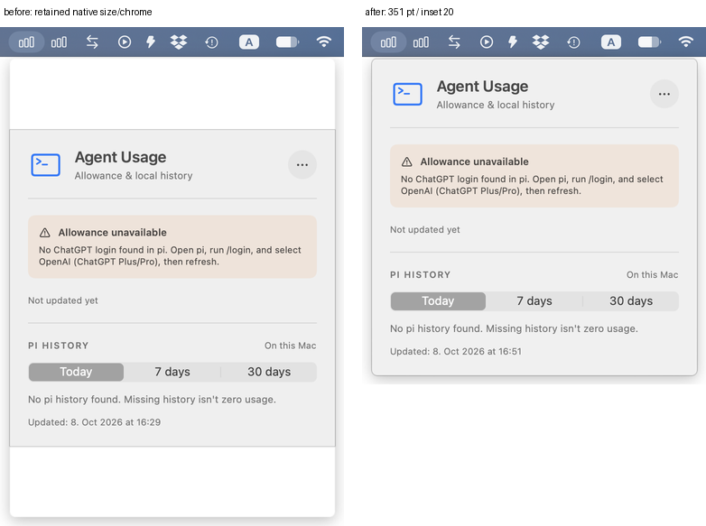
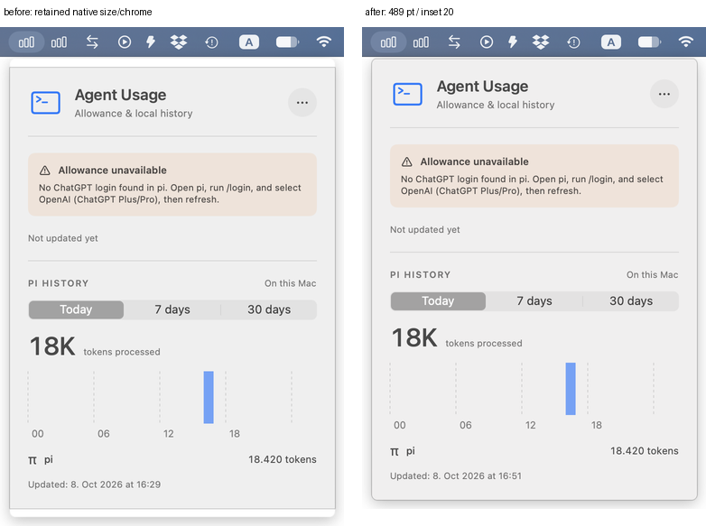
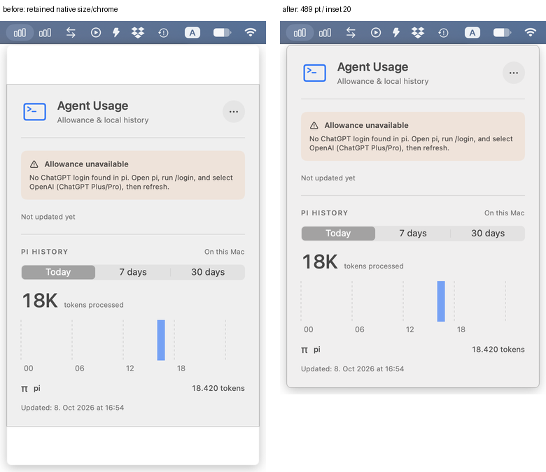

# PR 18 native sizing fix and verification

Fix commit: `7f96995594b05780934823158b68c5c3393d7180`.
Before-fix PR head: `d11dcc354db4b460f632eee405cf4d39154a38f2`.

## Fix

The bounded SwiftUI viewport already computes the right size. MenuBarExtra's retained native window grows but fails to shrink on the tested macOS version. A small `DashboardWindowSize` background bridge now applies the measured viewport size to the actual NSWindow after layout. It coalesces pending updates, ignores unchanged sizes, and preserves the window's top edge. The existing content-size cap and scrolling fallback are unchanged. No new scan triggers, fixture mode, app-window replacement, or private APIs are added.

## Matched native before/after







These labeled composites are half-size Retina copies of the full-resolution `screencapture` originals. Original images, AX geometry/text, input metadata and executable hashes are retained in `evidence/` (initial review) and `fix-evidence/` (fix verification).

| Retained native scenario | Before height / header inset | After height / header inset |
| --- | --- | --- |
| Partial → ready after close/reopen | 508 / 29 | **489 / 20** |
| Partial → ready via Refresh while open | 508 / 29 | **489 / 20** |
| Partial → ready → partial → ready → missing | 508 / 98 | **351 / 20** |
| Loading → ready → partial → ready, same app/window | 508 / 29 at recovery | **489 / 20 at recovery** |
| Overflow → scroll → ready after close/reopen | 600 / 75 at recovery | **489 / 20 at recovery** |

All values are points. The fixed retained-window sizes and insets match freshly opened equivalents throughout the checked sequences. Initial ready is 489, partial is 508, missing is 351, unsupported is 365, zero-recorded history is 489, and loading history is 328. Top anchoring and width 360 remain correct. Period selection and synthetic totals are checked for Today / 7 days / 30 days and after reopening.

### Actual native loading and overflow

No injected stores or app patches are used.

- **Loading:** generate a 120 MiB synthetic v3 session by repeating one operation with ignored synthetic content padding. Open immediately during the cold scan and assert/capture `Reading pi history…`. The repeated identity deduplicates to 18,420 tokens when ready. In the same process, replace with partial input and Refresh, then replace with ready input and Refresh. Both builds show 328 → 489 → 508; the old build sticks at 508 while the fix returns to 489.
- **Overflow:** start with synthetic partial history plus one toolResult with one token. Rename only the isolated session directory and put a regular file at its original path. Real Refresh fails and retains the prior partial/tool snapshot, adding enough warning content to reach the 600-point scroll cap. Drive the actual native scroll bar with `osascript` (`set value of scroll bar 1 ... to 1.0`). AX footer Y changes from 610 to 602 in both builds, proving movement. Restore the directory with ready input and reopen in the same process. Old head remains 600 / inset 75; fix shrinks to 489 / inset 20.

## Tests/builds

- Clean, separate **CLT release build** of fix commit succeeds, including packaging and signature verification. The log preserves the existing linker search-path warnings.
- **Xcode tests:** 95 executed, 3 skipped, 0 failures. Isolated opt-in memory regression also passes; measured extra footprint is 884,736 bytes.
- **Formatting:** strict format check passes locally.
- **CI:** [fix-head run passes](https://github.com/gadkadosh/agent-usage/actions/runs/37795769546).
- **Regression sensitivity:** the strengthened sizing tests check actual NSWindow dimensions and top anchoring through errors, overflow/recovery and history shrink/growth. Hosting min/max size constraints are disabled so they cannot accidentally supply the resize behavior being tested. Removing the bridge produces 5 assertion failures; restoring it makes the suite pass. This is boundary regression coverage, not a replacement for the packaged native evidence above.

## Reproduce

Host used: macOS 27.0.1 (26A434), Retina display, light appearance. Python 3, Command Line Tools, full Xcode, and native input/Automation/Accessibility/screen-capture permissions are required. No real credentials or histories are read. Every launched app gets both pi directory environment overrides. `auth.json` is absent, so allowance fails locally before HTTP. The user's existing app remains running and untouched.

The native drivers launch the actual executable inside an unchanged, signature-verified copy of the packaged `.app`, with the sandbox environment. The copied executable's SHA-256 is checked against the built artifact. Returned PIDs isolate all inspection, controls and cleanup. The Swift helper supplies only native status-item clicks and an external neutral backdrop. Controls/inspection use direct `osascript`; screenshots use `screencapture`.

From the root of a checkout of this evidence branch, set `REPO` to your product clone containing both commits. Create worktrees only once:

```sh
REPO=/path/to/agent-usage
HERE="$PWD"
git -C "$REPO" worktree add --detach "$HERE/head" d11dcc354db4b460f632eee405cf4d39154a38f2
git -C "$REPO" worktree add --detach "$HERE/fixed" 7f96995594b05780934823158b68c5c3393d7180
(cd head && DEVELOPER_DIR=/Library/Developer/CommandLineTools bash scripts/build-app.sh)
(cd fixed && DEVELOPER_DIR=/Library/Developer/CommandLineTools bash scripts/build-app.sh)
(cd fixed && DEVELOPER_DIR=/Applications/Xcode.app/Contents/Developer swift test --scratch-path .build-xcode)
xcrun swiftc MenuBarCapture.swift -o helper
python3 fix-native.py > fix-evidence/native-rerun.log 2>&1
python3 fix-loading.py > fix-evidence/loading-rerun.log 2>&1
python3 fix-overflow.py > fix-evidence/overflow-rerun.log 2>&1
# Expected: all three commands exit 0; fixed recovery is 489/20 or 351/20.
```

Scripts use the checked-in synthetic fixture bytes in `evidence/fixtures`. Remove that directory before running to regenerate fixture dates for another day. Loading's large file is generated locally, never published. Other input formats, the original main comparison, and initial-review commands are documented in [before-review.md](before-review.md). The historical `check-acceptance.py` is intentionally a failing check of the pre-fix captures; use `fix-native.py` for the fixed acceptance check.

Not verified: successful live allowance in the packaged app, dark appearance, small-screen/multi-display cases or other macOS versions. Synthetic component tests cover healthy allowance and large error content. Native evidence establishes the reproduced retained-size/chrome fix on the tested host, not universal macOS acceptance.
