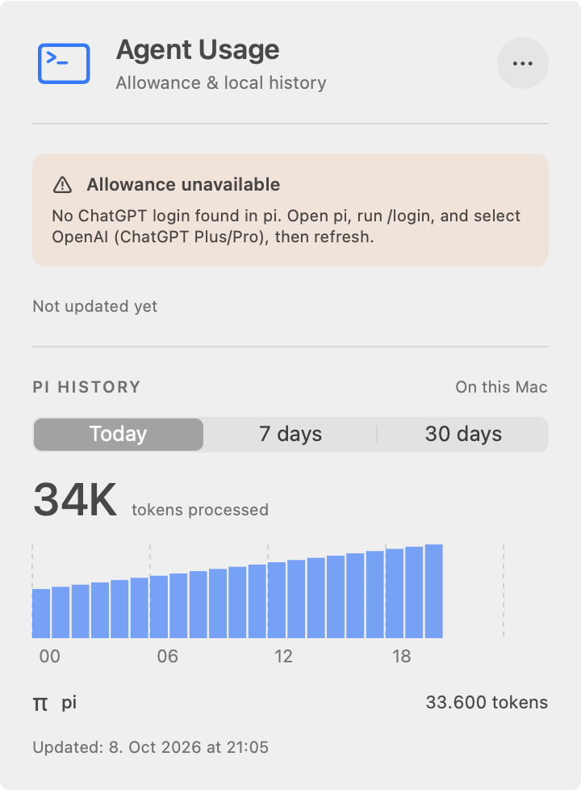
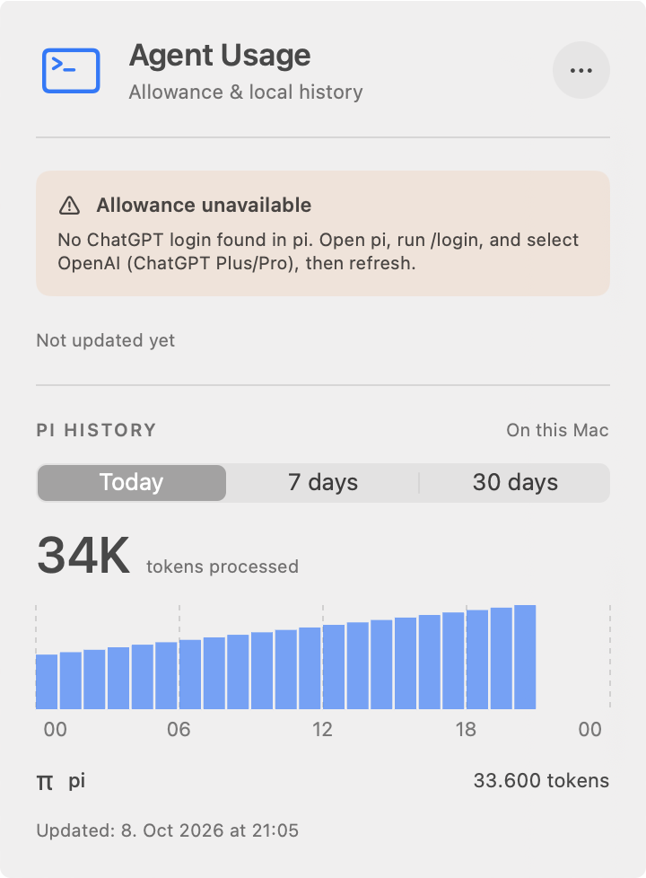
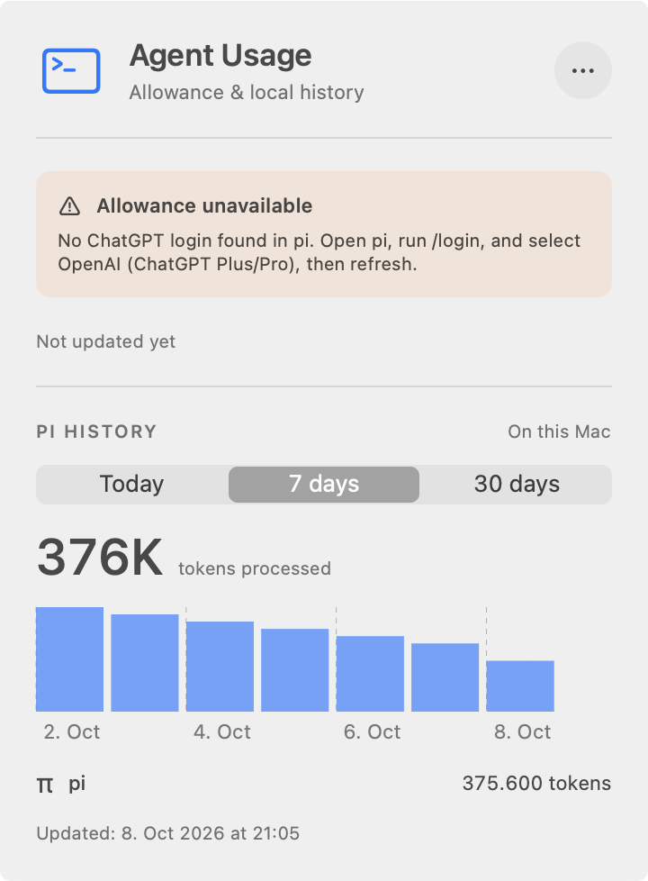
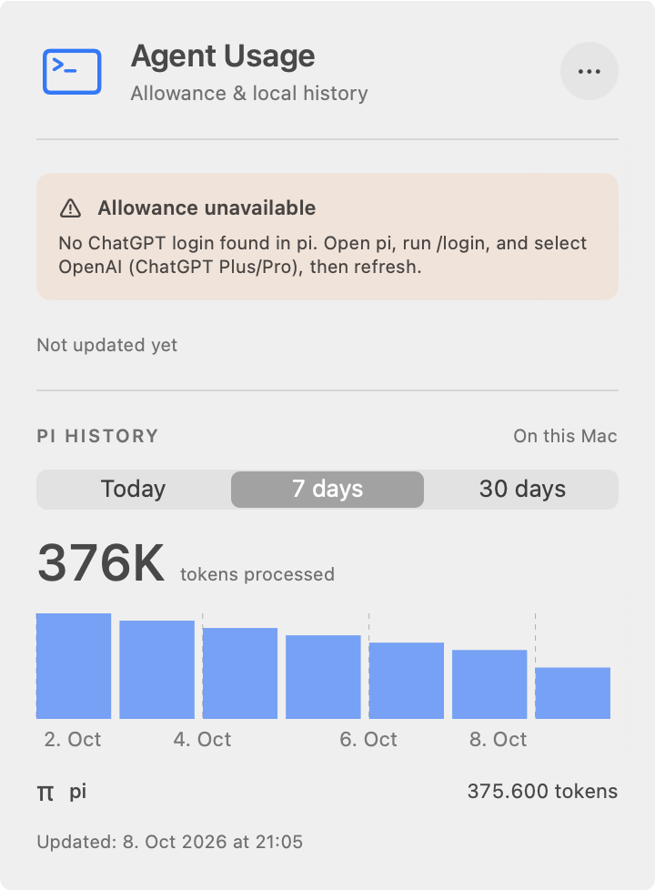
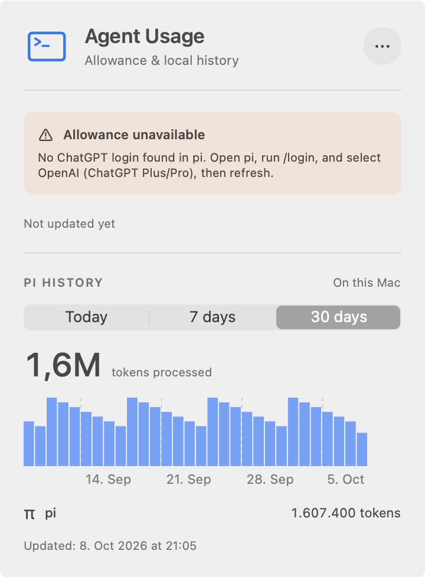
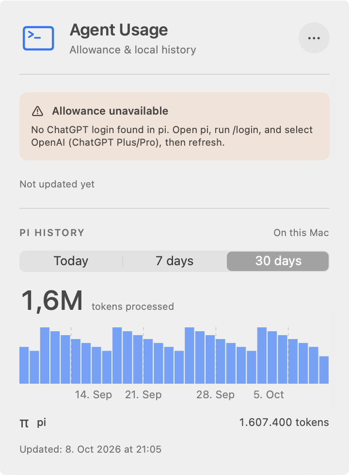

# Full-width history chart verification

Matched screenshots of the packaged app's actual MenuBarExtra window, not component renders.

- Before: `27323af`.
- After: `5dfb4cd`.
- macOS 27.0, Apple Silicon, light appearance, 360-point window at 2× scale.
- Same synthetic session file for both launches. No real credentials or histories were read.
- Empty synthetic `auth.json` intentionally shows unavailable allowance and prevents allowance requests.
- `capture.sh` builds and ad-hoc signs an isolated bundle with a distinct identifier and executable. It launches via `open --env`, inspects and selects accessible controls via direct `osascript`, then captures the actual window via `screencapture -l`.
- AXPress on the menu-bar item did not open the window on this Mac. The script uses a native CGEvent click at the item's accessible coordinates as a fallback. Period selection uses accessible radio buttons.
- The original AgentUsage process remained running. Each verification process was terminated independently.

## Reproduce

Needs Command Line Tools for packaging, Python 3, and Accessibility/Screen Recording permission for the terminal running these commands. Run both captures on the same calendar day. The fixture is generated once and reused.

From a checkout containing both commits, with this evidence directory available separately:

```sh
evidence=/absolute/path/to/this/evidence-directory
git worktree add --detach /tmp/chart-before 27323af
git worktree add --detach /tmp/chart-after 5dfb4cd
bash "$evidence/capture.sh" /tmp/chart-before /tmp/chart-captures before
bash "$evidence/capture.sh" /tmp/chart-after /tmp/chart-captures after
```

These exact script flows were executed against both revisions. Each capture prints `1, 0, 0`, `0, 1, 0`, and `0, 0, 1` as the picker selection changes. Screenshots contain only synthetic counts and the app's login guidance.

Expected outcomes:

- Before: 28 points of reserved right padding; all tick labels lead from their gridlines.
- After: zero plot-range padding. First label leads, last label trails, and interior labels are centered. No visible label clipping or overlap in any of the three captured periods.
- Today: next-midnight label is now visible at the right edge. Empty future-hour buckets remain empty, not padding.
- Week/month: bars extend across the available plot width; the existing 10% inter-bucket gap remains, including the final bucket's small gutter.
- Totals are unchanged: Today 33,600; week 375,600; month 1,607,400 tokens for this fixture.

| Period | Before | After |
|---|---|---|
| Today |  |  |
| 7 days |  |  |
| 30 days |  |  |

## Other checks

```sh
# Fresh, separate CLT build directory, independent of Xcode tests.
DEVELOPER_DIR=/Library/Developer/CommandLineTools \
  swift build --scratch-path /tmp/chart-clt-clean --configuration release --product AgentUsage

DEVELOPER_DIR=/Applications/Xcode.app/Contents/Developer swift test
DEVELOPER_DIR=/Applications/Xcode.app/Contents/Developer make format-check
git diff --check
```

Clean release build passed. Xcode tests ran 95 tests, with 3 opt-in tests skipped and 0 failures. Formatting and diff checks passed. CLT's linker emitted its existing missing-search-path warnings; packaging and signature verification passed. See `validation.txt`.
