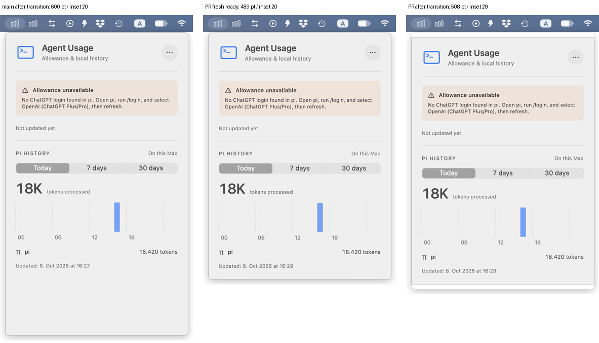
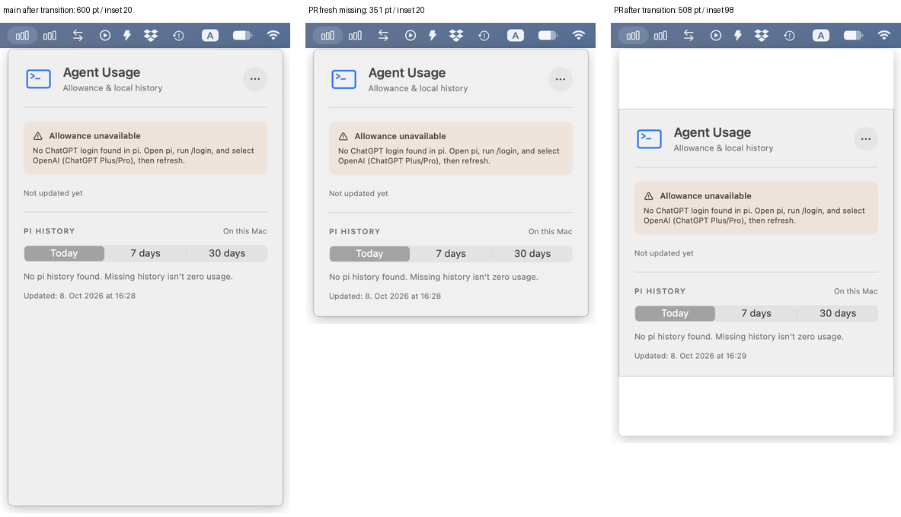

# PR 18 native verification, 2026-10-08

**Verdict: not ready to merge.** Exact PR head `d11dcc354db4b460f632eee405cf4d39154a38f2` still fails native size recovery. Main comparison is `439d255`.

## Matched screenshots

These compare main after the same transition, a fresh PR window, and the retained PR window after transition. Full-resolution, unmodified `screencapture` originals and matching AX geometry/text are in the scenario directories. Comparison images are labeled composites at half the Retina pixel dimensions. All reported geometry is in points.





| Exact PR head scenario | Native height | Header inset | Expected from fresh equivalent |
| --- | ---: | ---: | --- |
| Fresh ready | 489 | 20 | 489 / 20 |
| Fresh partial | 508 | 20 | 508 / 20 |
| Fresh missing | 351 | 20 | 351 / 20 |
| Partial → ready, close/reopen | 508 | 29 | 489 / 20 |
| Partial → ready, manual Refresh while open | 508 | 29 | 489 / 20 |
| Partial → ready → partial → ready → missing, close/reopen | 508 | 98 | 351 / 20 |
| Missing → ready → partial, close/reopen | 508 | 20 | 508 / 20 |
| Then partial → ready | 508 | 29 | 489 / 20 |

Measured behavior: the retained native window grows but does not shrink. The warning disappears and totals remain correct, but content becomes vertically centered inside stale native geometry. Screenshots expose white bands and mismatched chrome. Main retains its intentional 600-point viewport with a 20-point header inset throughout the matched scenarios.

The strict acceptance checker exits **1** with **8 geometry failures**, all on the PR head. No main comparison fails. `verification.log` alone is not acceptance: it checks synthetic text, period selection, warning state, width, cap and anchoring, while `check-acceptance.py` compares retained geometry with fresh equivalent geometry.

## Verified scope

- Fresh missing, ready, partial, unsupported and zero-recorded history on both builds.
- Today / 7 days / 30 days, including correct synthetic totals of 18,420 / 128,940 / 552,600 and reopening with the selected period retained.
- Missing → ready → partial → ready → missing in one app process and retained native MenuBarExtra.
- Partial → ready → partial → ready → missing → ready across close/reopen, without restarting the app.
- Partial → ready → partial → ready using accessible Refresh while the window stays open.
- Exact PR head clean CLT release packaging/signature verification succeeds. The separately clean main CLT release build also succeeds. Build logs retain the CLT linker search-path warnings.
- Exact PR head Xcode tests: 94 executed, 3 skipped, 0 failures. Separate `.build-xcode` scratch path prevents this test build from replacing the CLT release artifact.

Not verified in this round: healthy account allowance, a deliberately delayed loading state, native overflow/scroll recovery, dark appearance, small screens, or other macOS versions. No claim of complete native acceptance is made. Passing component sizing tests do not override the observed native failure; those tests inspect `NSHostingView.fittingSize`, not MenuBarExtra's retained native size.

## Minimal reproduction setup

Host: macOS 27.0.1 (26A434), Retina display, light appearance. Full Xcode is installed at `/Applications/Xcode.app`; default selected tools are `/Library/Developer/CommandLineTools`. Python 3 and native input/Automation/Accessibility and screen-capture permissions are required.

Only invented history files are used. See `evidence/fixtures/`: a v3 session with 30 synthetic assistant operations, 18,420 tokens each; partial adds one malformed line; unsupported changes the session version to 99; zero contains only the v3 header; missing has no session file. The script copies the same fixture bytes for both builds. Dates are generated relative to the run so all periods have readings. Keep the checked-in files to reproduce this run's original input, or remove `evidence/fixtures` to regenerate dates on another day.

`auth.json` is deliberately absent in every sandbox, so allowance fails locally before HTTP. Both `PI_CODING_AGENT_DIR` and `PI_CODING_AGENT_SESSION_DIR` point to temporary synthetic directories. Real credentials and histories are not read or changed.

The script copies each packaged `.app` unchanged and verifies the copied executable's SHA-256 and bundle signature. It launches the copied bundle's actual executable directly with the isolated environment and targets its returned PID. The existing user's app is untouched. There is no injected view, fixture mode, source patch, executable retagging or re-signing. `MenuBarCapture.swift` supplies only external native status-item clicks and a neutral backdrop. Periods and Refresh are driven by direct `osascript` accessible controls; inspection uses `osascript`; screenshots use `screencapture`.

### Commands

Run from the root of a checkout of this evidence branch. Set `REPO` to a local clone containing the main and PR commits. Create the worktrees only once.

```sh
REPO=/path/to/agent-usage
HERE="$PWD"
git -C "$REPO" worktree add --detach "$HERE/base" 439d255
git -C "$REPO" worktree add --detach "$HERE/head" d11dcc354db4b460f632eee405cf4d39154a38f2
(cd base && DEVELOPER_DIR=/Library/Developer/CommandLineTools bash scripts/build-app.sh) > evidence/base-build.log 2>&1
(cd head && DEVELOPER_DIR=/Library/Developer/CommandLineTools bash scripts/build-app.sh) > evidence/head-build.log 2>&1
(cd head && DEVELOPER_DIR=/Applications/Xcode.app/Contents/Developer swift test --scratch-path .build-xcode) > evidence/head-tests.log 2>&1
xcrun swiftc MenuBarCapture.swift -o helper
python3 verify.py > evidence/verification.log 2>&1
python3 check-acceptance.py > evidence/acceptance.log
# Expected on this head: exit 1; 8 retained-window geometry failures.
```

The verifier is restartable: it replaces only its own copied bundles, overwrites synthetic fixtures and captures, and terminates only its own app processes and backdrop. It does not stop the user's app. `old-capture.py` is a historical utility dependency recovered from `e558655`; its standalone main and loose historical assertions are not used for acceptance.

### Smallest manual failure

1. Launch the CLT-packaged PR app with both pi directory overrides pointing to a synthetic partial fixture and no auth file.
2. Open its actual menu-bar window. Expect 360 × 508 points and header inset 20.
3. Close the window via its status item, remove only the malformed line from the synthetic session, and reopen in the same app process. Alternatively, remove the malformed line while open and use More options → Refresh.
4. The partial warning should disappear and the native window should become 360 × 489 with header inset 20. **Observed: 360 × 508 with inset 29.**
5. Close, remove the synthetic session, and reopen. Expect 360 × 351 with inset 20. **Observed: 360 × 508 with inset 98 and large white bands.**

No production files or PR commits were changed by this review.
