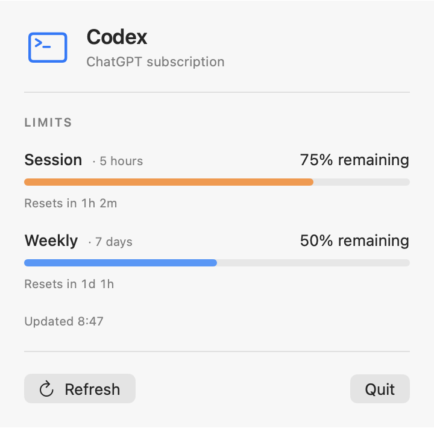

# Agent Usage

A minimal macOS menu-bar app showing the 5-hour and 7-day Codex usage limits associated with your ChatGPT subscription.

## Requirements

- macOS 13 or newer
- Swift 6 / Apple Command Line Tools (or Xcode)
- A current ChatGPT/Codex access token in the `OPENAI_ACCESS_TOKEN` environment variable

The app requests usage directly and refreshes about once a minute; use **Refresh** in the panel for an immediate update. The ChatGPT endpoint is not a supported public API and may change without notice.

## Dashboard

Click the menu-bar label to see your remaining session and weekly allowance and reset countdowns.



*Shown with sample data.*

## Run

Set `OPENAI_ACCESS_TOKEN` in the terminal that launches the app, then run:

```sh
swift run
```

Avoid pasting the token into a shell command that will be saved in your history. The access token expires; if you get an HTTP 401 error, start the app again with a current token. This version does not manage sign-in or token refresh. Apps launched from Finder will not automatically inherit your terminal's environment variables.

Run tests with `swift test` when full Xcode is installed and selected. The Apple Command Line Tools installation on its own does not provide XCTest in this environment.

`swift run` builds and launches an executable; it does not create an installable `.app` bundle. Packaging and additional usage sources are future steps.

## License

[MIT](LICENSE) © 2026 Gad Kadosh.
