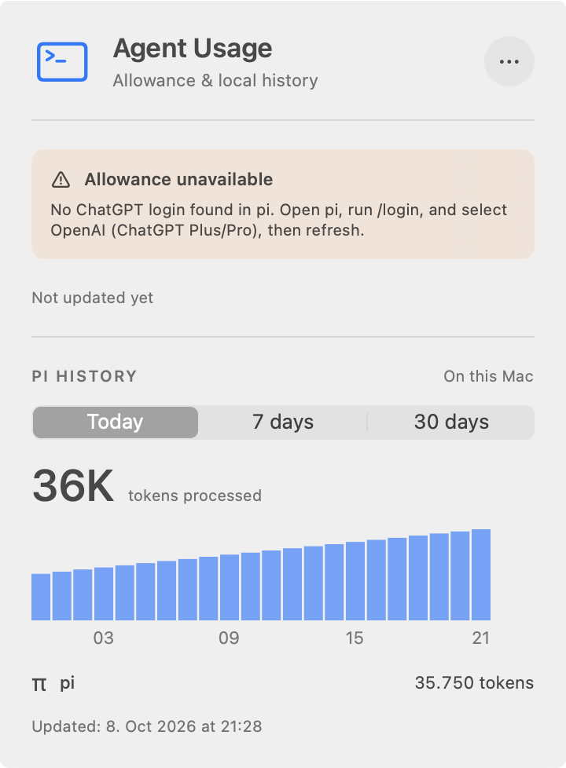
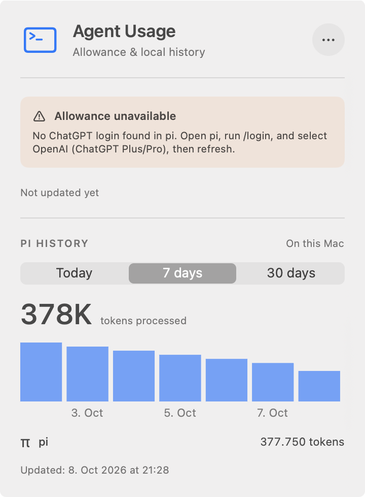
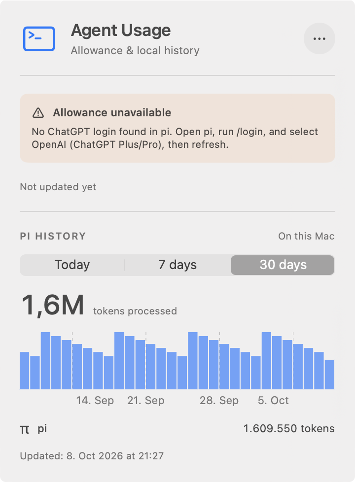
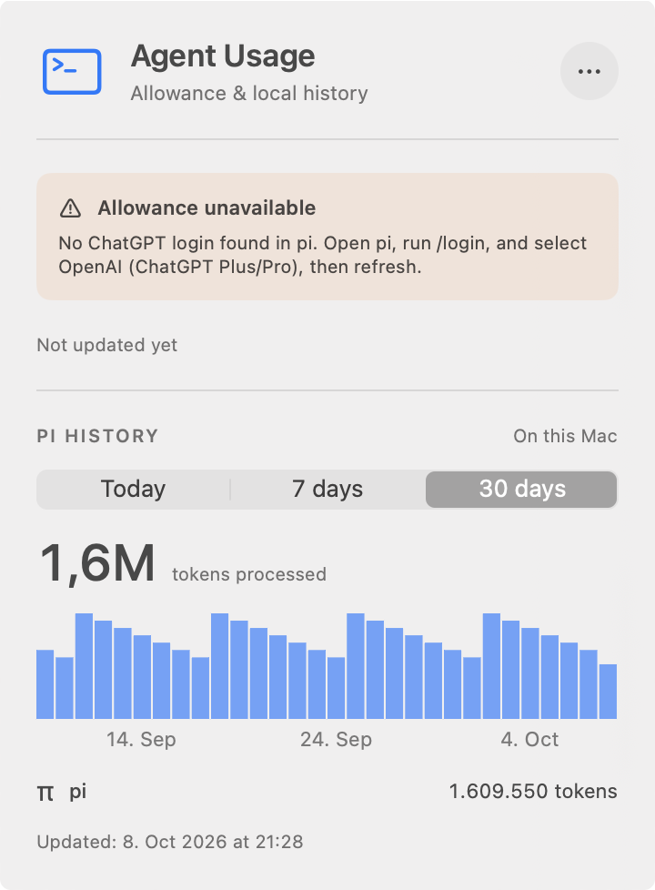

# Bar-caption revision for PR #22

Matched captures of the packaged app's actual menu-bar window, using the same synthetic history.

- Before: previous PR revision `5dfb4cd`, with gridlines and timestamp-axis labels.
- After: `e61be18`, with sparse captions centered beneath actual bars.
- macOS 27.0, Apple Silicon, light appearance, 360-point window at 2× scale.
- Default locale used 24-hour captions. Supplemental `en_US` captures verified AM/PM and month-first dates in all three periods.
- Empty synthetic credentials intentionally show unavailable allowance. No real credentials, histories, or network requests were used.
- The original AgentUsage process was left running. Verification used a distinct bundle identifier and executable, and terminated only its own process.

## Observed results

- No vertical gridlines remain.
- Today captions `03`, `09`, `15`, `21` identify the selected hourly bucket starts.
- Week captions `3 Oct`, `5 Oct`, `7 Oct` identify bars 2, 4, 6, respectively.
- Month captions `14 Sep`, `24 Sep`, `4 Oct` identify bars 6, 16, 26, respectively.
- Every caption is centered on the painted rectangle, excluding the existing 10% trailing gutter. There are no shifted endpoint labels.
- Daily captions are sampled away from the edges. No visible caption clipping or overlap appeared in the captured periods/locales.
- The plot remains full-width. Bar geometry and totals are unchanged: 35,750 / 377,750 / 1,609,550 tokens for this fixture.

| Period | Before | After |
|---|---|---|
| Today |  |  |
| 7 days |  |  |
| 30 days |  |  |

Supplemental US captures: [Today](after-us-today.png), [7 days](after-us-week.png), [30 days](after-us-month.png).

## Reproduce

Requires Command Line Tools, Python 3, and terminal Accessibility/Screen Recording permission. Do not run native-window tests concurrently with captures; their windows can steal focus. Run both revisions on the same calendar day. The fixture is generated once and reused.

From a checkout containing both revisions, with this evidence directory available separately:

```sh
evidence=/absolute/path/to/this/bar-captions-directory
git worktree add --detach /tmp/caption-before 5dfb4cd
git worktree add --detach /tmp/caption-after e61be18
bash "$evidence/capture.sh" /tmp/caption-before /tmp/caption-captures before
bash "$evidence/capture.sh" /tmp/caption-after /tmp/caption-captures after
bash "$evidence/capture.sh" /tmp/caption-after /tmp/caption-captures after-us \
  -AppleLocale en_US -AppleLanguages '(en)'
```

These script flows were executed for both revisions and the supplemental locale. The script packages the release executable, re-signs an isolated bundle, and launches it with synthetic pi-directory overrides via `open --env`. It uses direct `osascript` to inspect/select accessible controls and `screencapture -l` for window captures. AXPress did not open MenuBarExtra on this Mac, so the script falls back to a native CGEvent click at the item's accessible coordinates. Picker values print `1, 0, 0`, `0, 1, 0`, `0, 0, 1`.

## Other checks

```sh
# Fresh, separate Command Line Tools release build, independent of Xcode tests.
DEVELOPER_DIR=/Library/Developer/CommandLineTools \
  swift build --scratch-path /tmp/caption-clt-clean --configuration release --product AgentUsage
DEVELOPER_DIR=/Applications/Xcode.app/Contents/Developer swift test
DEVELOPER_DIR=/Applications/Xcode.app/Contents/Developer make format-check
git diff --check
```

Clean release build passed. Xcode tests ran 98 tests, with 3 opt-in tests skipped and zero failures. Three new tests verify selected bucket identities, painted-bar centers for irregular interval lengths, and empty/short summaries. Formatting and diff checks passed. CLT emitted its existing missing-linker-search-path warnings; packaging and signature verification passed. See `validation.txt`.
