# Remaining-allowance screenshots

Native SwiftUI panels rendered with **sample data**, not a live account. Both windows use the same remaining value in each image so the lengths and color intensity can be compared directly.

- **Session:** orange. **Weekly:** blue.
- Meter opacity: `0.65 + 0.35 × remainingFraction`.
- Percentage text stays at full contrast. No low-allowance warning.
- Click any screenshot for full resolution.

## Light appearance

| 100% remaining · opacity 1.00 | 75% remaining · opacity 0.9125 | 50% remaining · opacity 0.825 |
| --- | --- | --- |
| [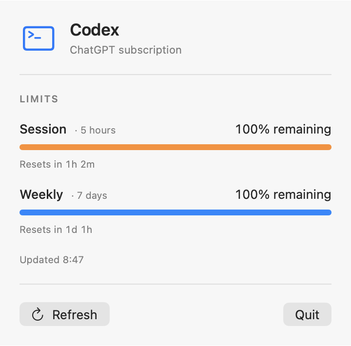](remaining-100-light.png) | [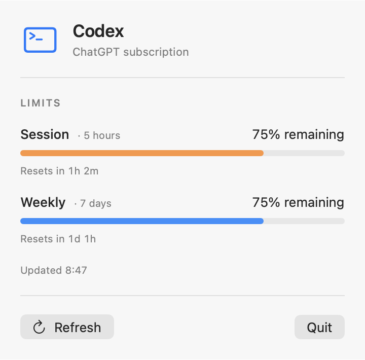](remaining-75-light.png) | [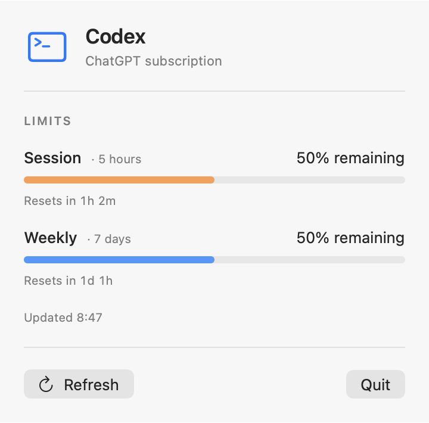](remaining-50-light.png) |

| 25% remaining · opacity 0.7375 | 10% remaining · opacity 0.685 | 0% remaining · empty meter |
| --- | --- | --- |
| [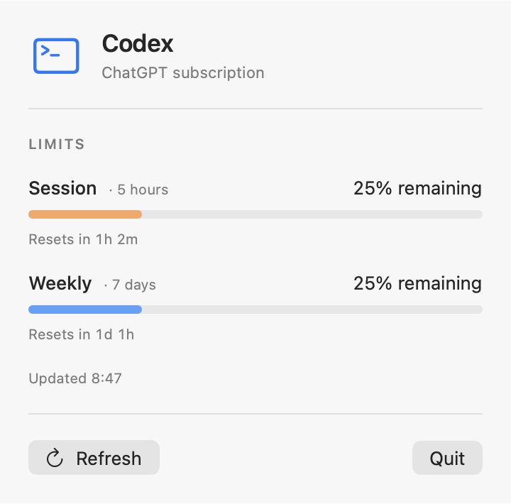](remaining-25-light.png) | [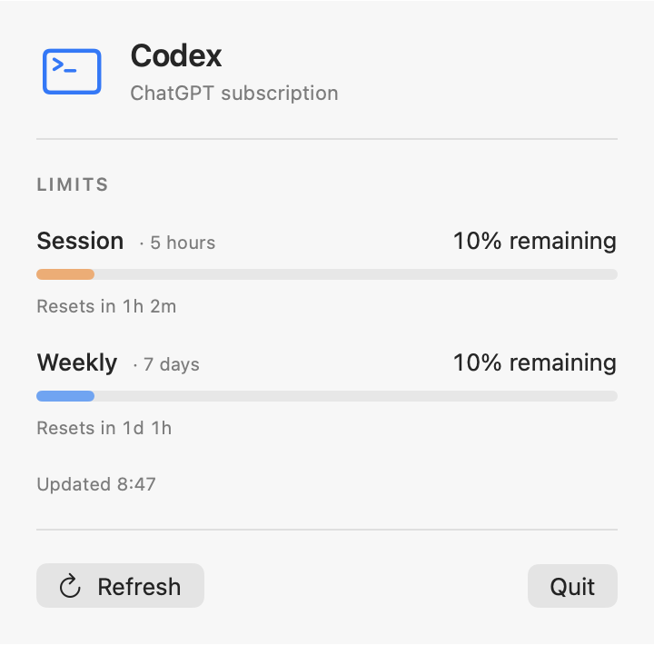](remaining-10-light.png) | [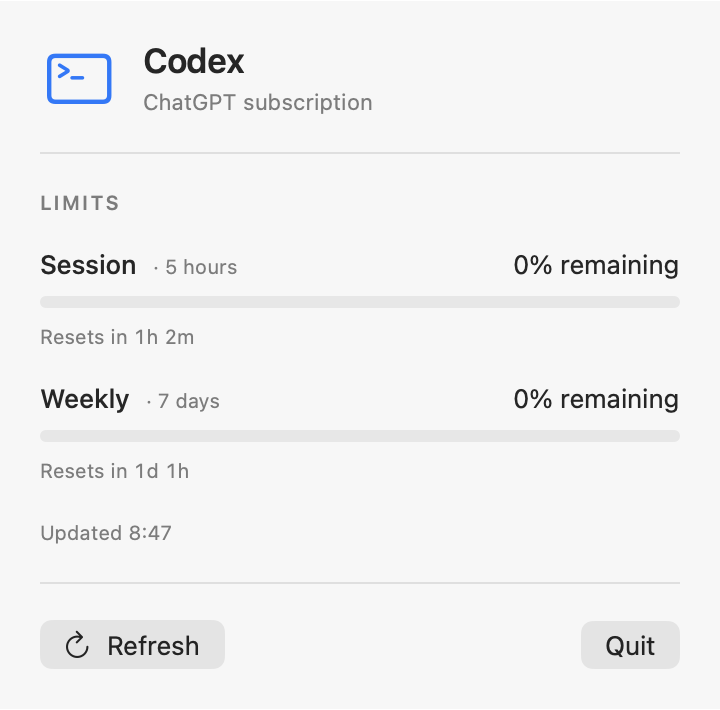](remaining-0-light.png) |

## Dark appearance

| 100% remaining | 75% remaining | 50% remaining |
| --- | --- | --- |
| [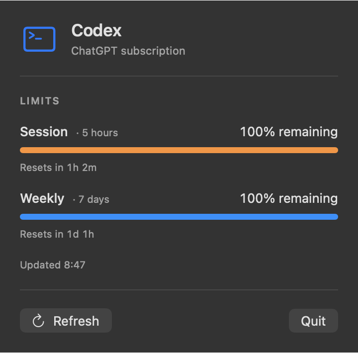](remaining-100-dark.png) | [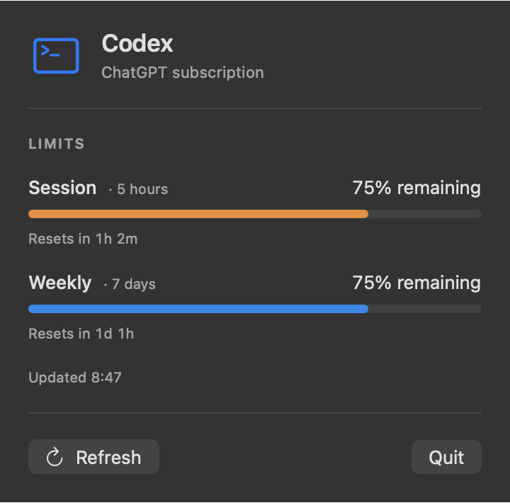](remaining-75-dark.png) | [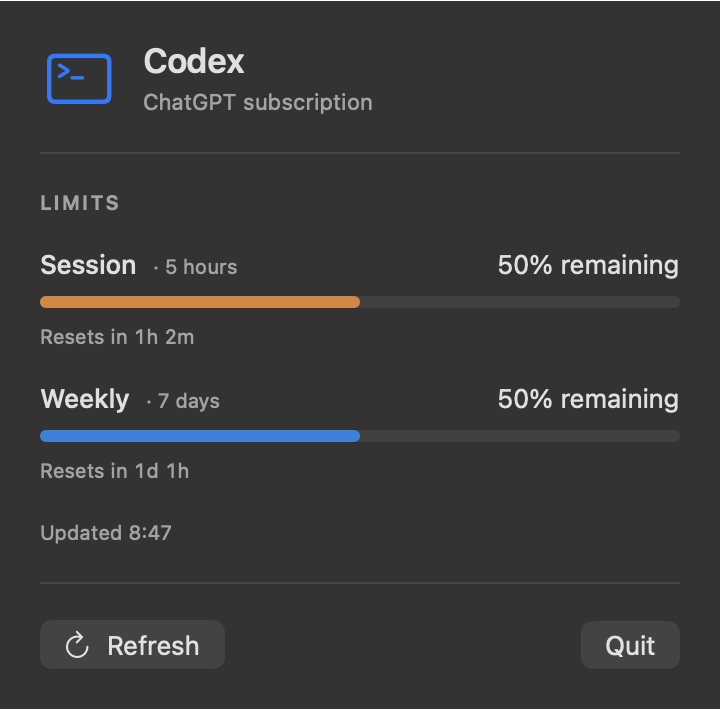](remaining-50-dark.png) |

| 25% remaining | 10% remaining | 0% remaining |
| --- | --- | --- |
| [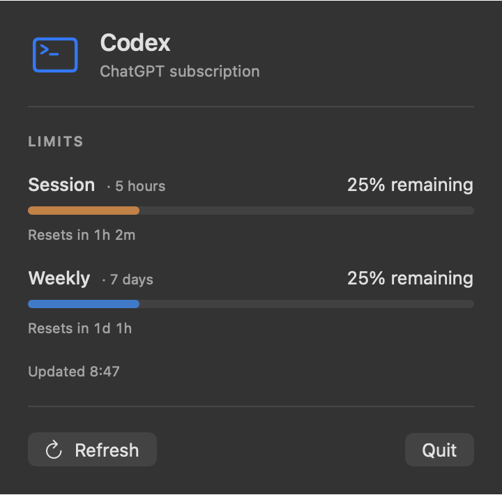](remaining-25-dark.png) | [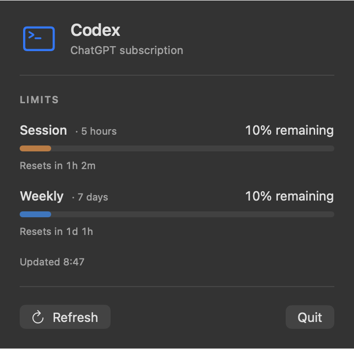](remaining-10-dark.png) | [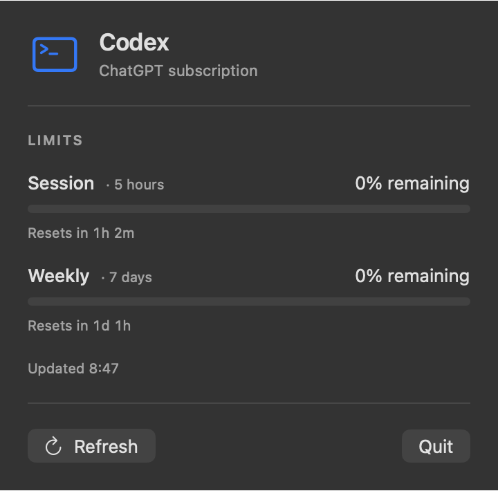](remaining-0-dark.png) |

## Regenerate

From the repository root on macOS, compile the native capture helper against the actual panel source:

```sh
xcrun swiftc -swift-version 6 -parse-as-library \
  Sources/AgentUsage/UsageClient.swift \
  Sources/AgentUsage/UsageSnapshot.swift \
  Sources/AgentUsage/UsagePanel.swift \
  scripts/render-dashboard.swift -o /tmp/render-dashboard
/tmp/render-dashboard /tmp/agent-usage-screenshots
```

The helper uses `NSHostingView` to capture the real SwiftUI layout; it does not fetch usage or require credentials. Generated files are written to the supplied directory (default: `/tmp/agent-usage-screenshots`).
