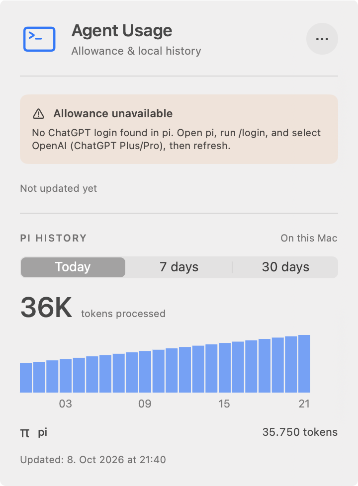
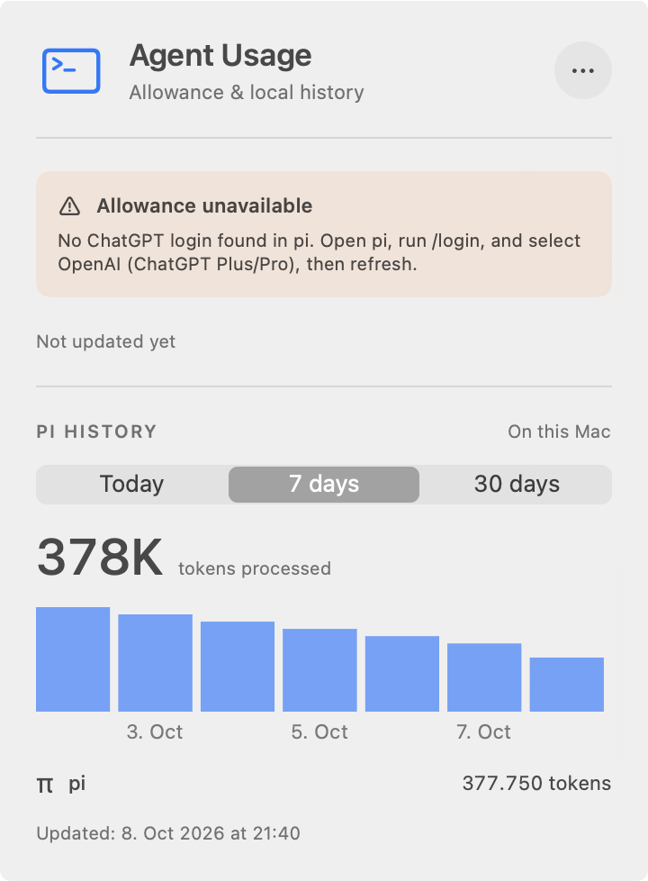
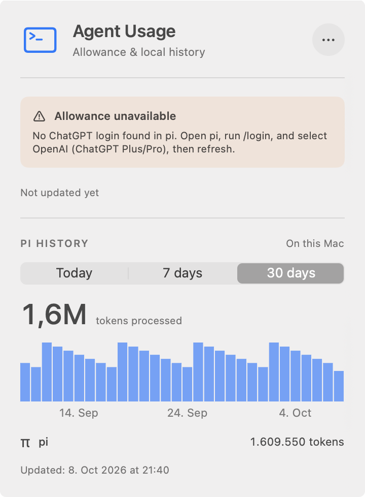
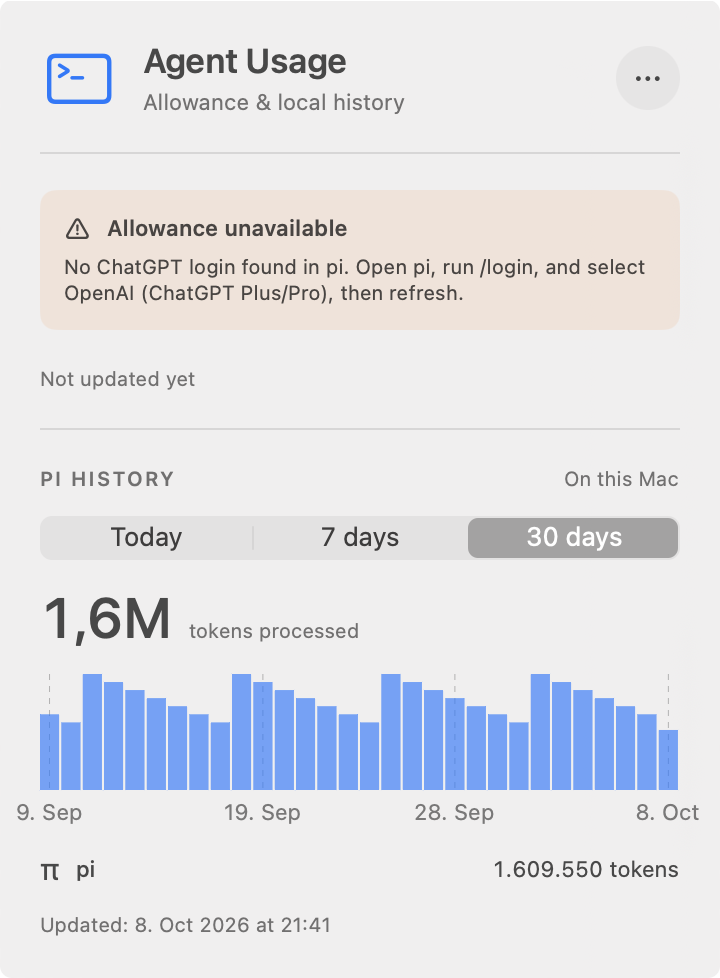

# Endpoint captions and restored gridlines for PR #22

Matched captures of the packaged app's actual menu-bar window.

- Before: `e61be18`, with interior-only captions and no gridlines.
- After: `c56eaca`, with endpoint-inclusive captions and bar-centered gridlines.
- macOS 27.0, Apple Silicon, light appearance, 360-point window at 2× scale.
- Same synthetic history file for before/after. Empty synthetic credentials prevent allowance requests. No real credentials or histories were read.
- Verification uses a distinct bundle identifier/executable and terminates only its own process. The original AgentUsage instance remained running.

## Observed results

- Weekly captions changed from `3, 5, 7 Oct` to `2, 4, 6, 8 Oct`, centered beneath bars 1, 3, 5, 7.
- Today captions identify the first/last hourly buckets: `00, 08, 15, 23`.
- Month captions identify the first/last daily buckets: `9 Sep, 19 Sep, 28 Sep, 8 Oct`.
- Vertical gridlines align with the captions and painted bar centers, not unrelated calendar timestamps.
- Captions use the bucket start for text and the painted rectangle's center for position. The 10% trailing bar gutter is excluded from that center.
- Endpoint text may extend into the panel's existing outer margin. It is not shifted off its bar or hidden by Charts' collision resolution. The plot still has zero added padding.
- No visible caption clipping or overlap appeared in these captures, including all three supplemental US-locale captures.
- Bar geometry and totals are unchanged: 35,750 / 377,750 / 1,609,550 tokens for this fixture.

| Period | Before | After |
|---|---|---|
| Today |  |  |
| 7 days |  |  |
| 30 days |  |  |

Supplemental US captures: [Today](after-us-today.png), [7 days](after-us-week.png), [30 days](after-us-month.png). These verify longer endpoint AM/PM captions and month-first dates.

## Reproduce

Requires Command Line Tools, Python 3, and terminal Accessibility/Screen Recording permission. Run both revisions on the same calendar day. Do not run native-window tests concurrently; their windows can steal focus.

```sh
evidence=/absolute/path/to/this/endpoint-captions-directory
git worktree add --detach /tmp/endpoint-before e61be18
git worktree add --detach /tmp/endpoint-after c56eaca
bash "$evidence/capture.sh" /tmp/endpoint-before /tmp/endpoint-captures before
bash "$evidence/capture.sh" /tmp/endpoint-after /tmp/endpoint-captures after
bash "$evidence/capture.sh" /tmp/endpoint-after /tmp/endpoint-captures after-us \
  -AppleLocale en_US -AppleLanguages '(en)'
```

These script flows were executed for both revisions and the supplemental locale. The script generates its synthetic fixture once and reuses it, packages the release executable, re-signs an isolated bundle, and launches it with synthetic pi-directory overrides via `open --env`. It uses direct `osascript` to inspect/select accessible controls and `screencapture -l` for actual-window screenshots. AXPress did not open MenuBarExtra on this Mac, so a native CGEvent click at the accessible menu-bar-item coordinates is used as a fallback. Picker values print `1, 0, 0`, `0, 1, 0`, `0, 0, 1`.

## CI failure and validation

The previous CI failure was **not formatting**. Xcode 26.3 timed out type-checking the test's bucket-construction `map` expression. The revised fixture gives the result an explicit type and computes start/end dates separately. This does not change the fixture's meaning.

```sh
DEVELOPER_DIR=/Library/Developer/CommandLineTools \
  swift build --scratch-path /tmp/endpoint-clt-clean --configuration release --product AgentUsage
DEVELOPER_DIR=/Applications/Xcode.app/Contents/Developer swift test
DEVELOPER_DIR=/Applications/Xcode.app/Contents/Developer make format-check
AGENT_USAGE_MEMORY_REGRESSION=1 DEVELOPER_DIR=/Applications/Xcode.app/Contents/Developer \
  swift test --skip-build --filter PiHistoryMemoryTests
git diff --check
```

[CI run 37833914666](https://github.com/gadkadosh/agent-usage/actions/runs/37833914666) passed on Xcode 26.3, including formatting, tests, the isolated memory regression, and CLT packaging. The fresh, separate local CLT release build passed. Local Xcode tests ran 98 tests, with 3 opt-in tests skipped and zero failures. The isolated memory test also passed. Formatting and diff checks passed. Caption tests now require first/last buckets in each period and exercise empty through four-bucket summaries. CLT's existing missing-linker-search-path warnings remain; packaging and signature verification passed. See `validation.txt`.
