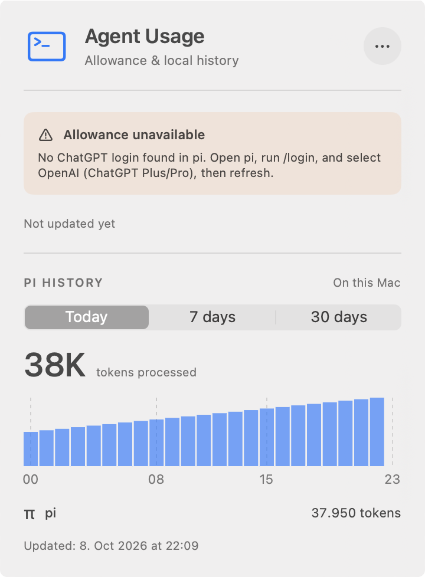
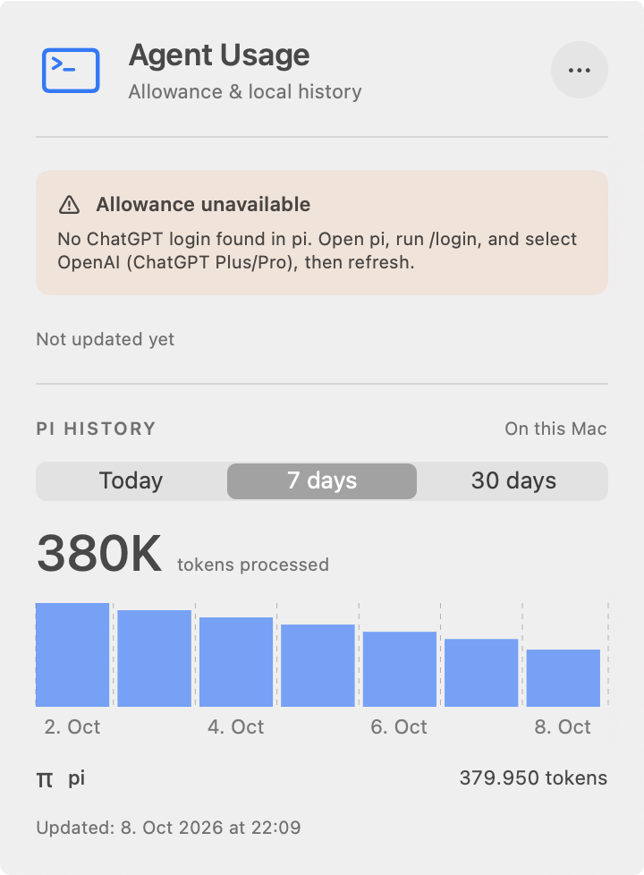
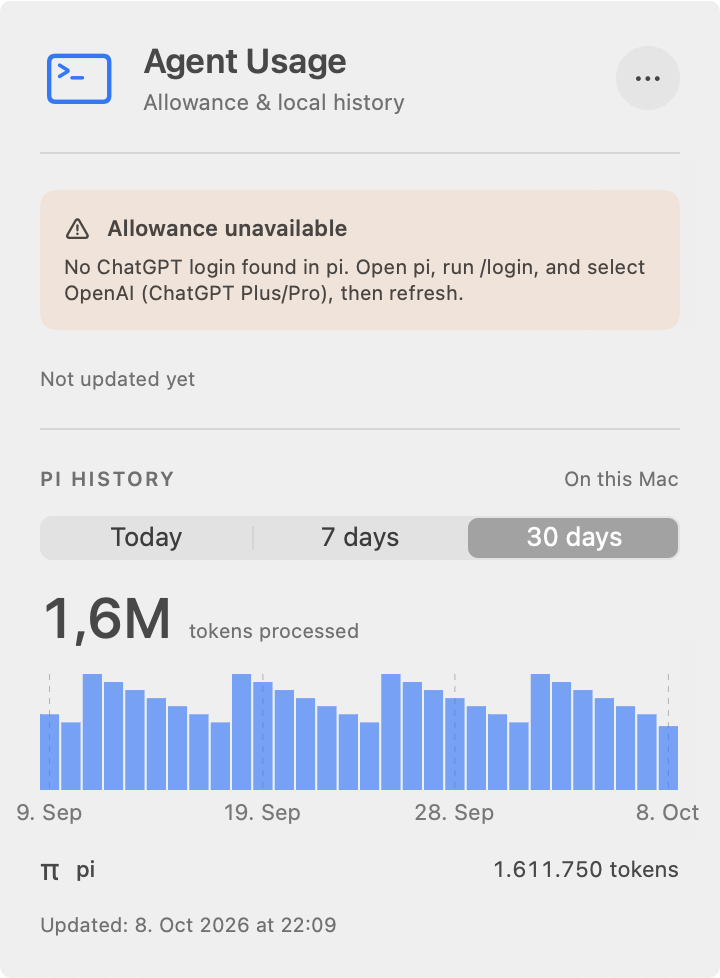

# Gap-centered gridlines for PR #22

Matched captures of the packaged app's actual menu-bar window, not design mocks or component renders.

- Before: `c56eaca`, with lines through selected bar centers.
- After: `88f2194`, with independent gap-centered separators.
- macOS 27.0, Apple Silicon, light appearance, 360-point window at 2× scale, default 24-hour locale.
- Same synthetic history and empty synthetic credentials for both launches. No real credentials, histories, or allowance requests were used.
- Verification uses a distinct bundle identifier/executable and terminates only its own process. The original AgentUsage instance was left running.

## Observed results

- 7 days: six interior lines separate every neighboring pair of bars, plus both outer plot-edge lines.
- Today: two interior lines in the gaps after bars 8 and 16, plus both edges.
- 30 days: two interior lines in the gaps after bars 10 and 20, plus both edges.
- Every interior line is at the actual gap midpoint: halfway between the previous painted bar's end and the next bar's start. No interior line runs through a bar center.
- The chart stays full-width. Captions remain centered beneath their bars, including the first/last captions. Weekly captions are still `2, 4, 6, 8 Oct`.
- Caption-region pixels are identical before/after in all three native captures. No visible clipping or overlap appeared.
- Bar geometry and totals are unchanged: 37,950 / 379,950 / 1,611,750 tokens for this fixture.

| Period | Before | After |
|---|---|---|
| Today |  |  |
| 7 days |  |  |
| 30 days |  |  |

`after-week-chart.png` is a crop of the actual window capture, not a separate render: `Image.open('after-week.png').crop((24, 654, 698, 832))`.

## Reproduce

Requires Command Line Tools, Python 3, and terminal Accessibility/Screen Recording permission. Run both revisions on the same calendar day. Do not run native-window tests concurrently; their windows can steal focus.

```sh
evidence=/absolute/path/to/this/gap-gridlines-directory
git worktree add --detach /tmp/gaps-before c56eaca
git worktree add --detach /tmp/gaps-after 88f2194
bash "$evidence/capture.sh" /tmp/gaps-before /tmp/gap-captures before
bash "$evidence/capture.sh" /tmp/gaps-after /tmp/gap-captures after
# Optional pixel check, requiring Pillow and the matched 720x978 capture layout:
python3 "$evidence/check-caption-pixels.py" /tmp/gap-captures
```

These script flows were executed for both revisions. The script generates its synthetic fixture once and reuses it, packages the release executable, re-signs an isolated bundle, and launches it via `open --env` with synthetic pi-directory overrides. Direct `osascript` inspects/selects accessible controls; `screencapture -l` captures the actual window. AXPress did not open MenuBarExtra on this Mac, so a native CGEvent click at the accessible menu-bar-item coordinates is used as a fallback. Picker values print `1, 0, 0`, `0, 1, 0`, `0, 0, 1`.

## Validation

```sh
DEVELOPER_DIR=/Library/Developer/CommandLineTools \
  swift build --scratch-path /tmp/gap-clt-clean --configuration release --product AgentUsage
DEVELOPER_DIR=/Applications/Xcode.app/Contents/Developer swift test
DEVELOPER_DIR=/Applications/Xcode.app/Contents/Developer make format-check
git diff --check
```

The fresh, separate local CLT release build passed. Local Xcode tests ran 102 tests, with 3 opt-in tests skipped and zero failures. Four new tests verify every weekly gap, sparse dividers in dense periods, real gaps on 23/25-hour days, and empty/single-bucket summaries. Formatting and diff checks passed. CLT's existing missing-linker-search-path warnings remain; packaging and signature verification passed.

[CI run 37837566560](https://github.com/gadkadosh/agent-usage/actions/runs/37837566560) passed on Xcode 26.3, including formatting, tests, isolated memory regression, and CLT packaging. See `validation.txt`.
