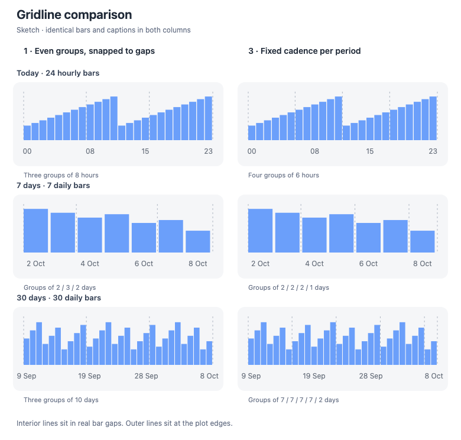

# Gridline option sketches

Browser-rendered design sketches, not native app screenshots. No app code changed for these mocks. Synthetic bar heights, identical across both options; captions and full-width geometry are held constant.

- **1: Even groups, snapped to actual gaps.** Two interior dividers plus the plot edges. For 24 / 7 / 30 bars, interior gaps follow bars 8 and 16 / 2 and 5 / 10 and 20.
- **3: Period-specific cadence.** Dividers every 6 hourly bars / 2 daily bars / 7 daily bars, plus both edges. Final groups can be shorter.
- Interior divider positions use the midpoint between the preceding painted bar's end and the next bar's start. Bars retain a 10% trailing gutter.
- Labels remain centered on their corresponding bars and include both endpoints, independently of the gridlines.

Run `python3 generate.py` to reproduce the SVG and an HTML preview. The PNG was captured from that HTML at a 780×744 viewport. This is a proposal comparison, not verification of a shipped implementation.
